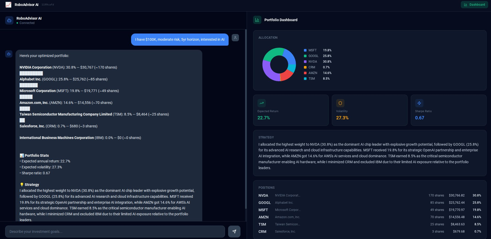

# 📈 RoboAdvisor AI

AI-powered robo-advisor that takes natural language investment goals, researches stocks in real time, and builds an optimized portfolio using Black-Litterman optimization — all orchestrated by a multi-agent LLM system.



## What It Does

1. **You describe your goals in plain English** — "I have $100K, moderate risk, interested in AI, 5-year horizon"
2. **Three AI agents coordinate behind the scenes:**
   - **Intake Agent** — Parses your input, asks follow-ups if anything's missing
   - **Research Agent** — Selects relevant tickers, fetches live prices, fundamentals, technicals, and news sentiment
   - **Strategy Agent** — Generates market views via Claude, runs Black-Litterman optimization, outputs portfolio allocation
3. **You get an optimized portfolio** with allocations, share counts, expected return, Sharpe ratio, and strategy reasoning

## Architecture

```
User Input (natural language)
        │
        ▼
┌──────────────┐     ┌─────────────┐     ┌──────────────┐
│ Intake Agent │────▶│Research Agent│────▶│Strategy Agent │
│  (Claude)    │     │  (Claude +   │     │  (Claude +    │
│              │     │   yfinance + │     │ Black-Litterman│
│ Parse profile│     │   NewsAPI)   │     │  optimizer)   │
└──────────────┘     └─────────────┘     └──────────────┘
        │                   │                    │
        └───────────────────┴────────────────────┘
                            │
                    ┌───────▼───────┐
                    │   Supabase    │
                    │  (persistent  │
                    │   memory)     │
                    └───────────────┘
```

**LLM Orchestration:** LangGraph manages the agent state machine — conditional routing (intake loops if profile is incomplete), shared state passing, and sequential execution.

**Portfolio Optimization:** Black-Litterman model blends market equilibrium returns (from market cap weights) with Claude-generated "views" (expected returns per asset with confidence levels) to produce optimal portfolio weights.

## Tech Stack

| Layer | Technology |
|-------|-----------|
| LLM | Claude (Anthropic API) |
| Orchestration | LangGraph |
| Backend | FastAPI + WebSocket |
| Frontend | React + Vite + Tailwind + Recharts |
| Data | yfinance (prices/technicals), NewsAPI (sentiment) |
| Optimization | Black-Litterman (numpy/scipy) |
| Database | Supabase (PostgreSQL) |

## Features

- **Conversational interface** — Natural language input with follow-up questions
- **Real-time research** — Live prices, P/E, RSI, MACD, Bollinger Bands, sentiment analysis
- **Black-Litterman optimization** — Institutional-grade portfolio math with LLM-generated views
- **Persistent memory** — Conversations, profiles, research cache, and strategies saved to Supabase
- **Real-time updates** — WebSocket streaming for live progress during research
- **Responsive dashboard** — Allocation pie chart, stat cards, positions table, research cards

## Quick Start

### Prerequisites

- Python 3.11+
- Node.js 18+
- API keys: [Anthropic](https://console.anthropic.com/), [NewsAPI](https://newsapi.org/), [Supabase](https://supabase.com/)

### 1. Clone & Configure

```bash
git clone https://github.com/AAP67/robo-advisor-ai.git
cd robo-advisor-ai
cp .env.example .env
# Edit .env with your API keys
```

### 2. Database Setup

Create a Supabase project, then run `backend/db/schema.sql` in the Supabase SQL Editor.

### 3. Backend

```bash
cd backend
pip install -r requirements.txt
uvicorn main:app --reload
```

### 4. Frontend

```bash
cd frontend
npm install
npm run dev
```

Open `http://localhost:5173` and start investing.

## Project Structure

```
robo-advisor-ai/
├── backend/
│   ├── main.py                 # FastAPI server (REST + WebSocket)
│   ├── graph.py                # LangGraph orchestration
│   ├── models.py               # Pydantic data models
│   ├── agents/
│   │   ├── state.py            # Shared agent state
│   │   ├── intake.py           # Profile parsing agent
│   │   ├── research.py         # Ticker selection + research agent
│   │   └── strategy.py         # BL optimization + strategy agent
│   ├── tools/
│   │   ├── market_data.py      # yfinance price/fundamentals
│   │   ├── technicals.py       # RSI, MACD, Bollinger Bands
│   │   ├── sentiment.py        # NewsAPI + Claude sentiment
│   │   └── research_pipeline.py# Orchestrates all data tools
│   ├── optimizer/
│   │   └── black_litterman.py  # Black-Litterman implementation
│   └── db/
│       ├── schema.sql          # Supabase table definitions
│       ├── supabase_client.py  # DB connection
│       └── memory.py           # Persistent storage layer
├── frontend/
│   └── src/
│       ├── App.jsx             # Two-panel layout
│       ├── components/
│       │   ├── Chat.jsx        # Conversational interface
│       │   ├── Portfolio.jsx   # Dashboard panel
│       │   ├── AllocationChart.jsx # Pie chart
│       │   └── AssetCard.jsx   # Research card
│       └── hooks/
│           └── useWebSocket.js # Real-time connection
└── .env.example
```

## How Black-Litterman Works Here

Traditional mean-variance optimization (Markowitz) uses only historical returns — garbage in, garbage out. Black-Litterman improves this by:

1. **Starting with market equilibrium** — Reverse-engineer expected returns from market cap weights (what the market "believes")
2. **Adding views** — Claude analyzes fundamentals, technicals, and news sentiment to generate expected return views with confidence levels
3. **Blending** — The math combines market consensus with Claude's views, weighted by confidence, to produce posterior expected returns
4. **Optimizing** — Standard optimization on the blended returns produces portfolio weights that reflect both market wisdom and AI analysis

The confidence parameter is key: a high-confidence bullish view on NVDA shifts more weight toward it. A low-confidence bearish view on a stock barely moves the needle. This prevents the optimizer from going all-in on any single AI opinion.

## Future Roadmap

- [ ] **v2: Execution layer** — Alpaca paper trading integration
- [ ] **Portfolio rebalancing** — "Update my portfolio" with new research
- [ ] **Multi-asset support** — ETFs, bonds, crypto
- [ ] **Backtesting** — Historical performance simulation
- [ ] **User authentication** — Multi-user support

## Built With

Built by [Karan Aggarwal](https://www.linkedin.com/in/karan-aggarwal-67/) — UC Berkeley Haas MBA, CFA Level 3 candidate.
